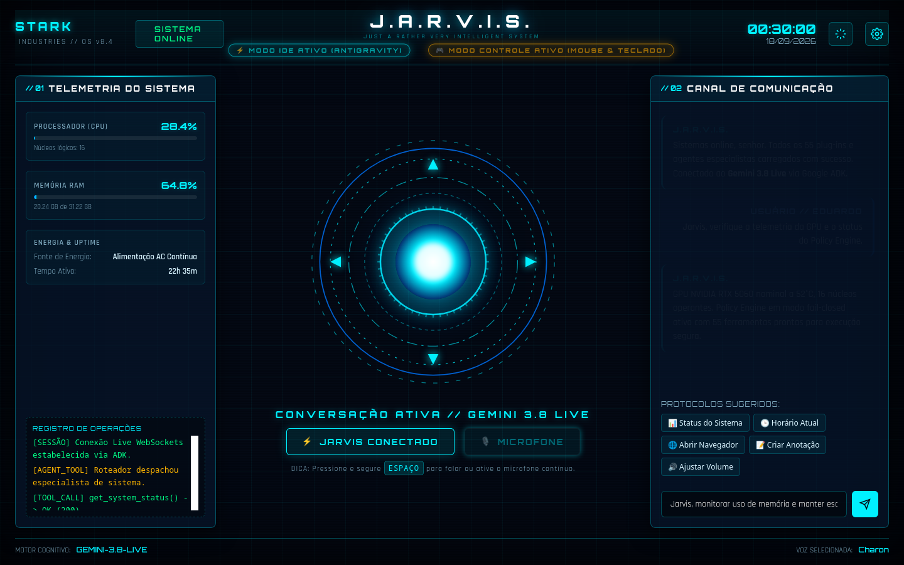

# JARVIS — Assistente Pessoal de IA com Gemini Live + Google ADK

<p align="center">
  <strong>Assistente pessoal multimodal em tempo real com voz, visão de tela, automação segura do Linux, tool calling e orquestração de agentes.</strong>
</p>

<p align="center">
  <a href="README.md">English</a> · <a href="README.pt-BR.md">Português (Brasil)</a>
</p>

<p align="center">
  
  
</p>

## O que é o JARVIS?

O **JARVIS** é um assistente pessoal de IA open source para Linux construído com **Gemini Live**, **Google Agent Development Kit (ADK)**, **FastAPI**, **WebSockets**, **PySide6**, plugins modulares e um **Policy Engine** para controlar ações sensíveis.

Ele foi criado para ir além de um chatbot. O sistema pode manter conversação de voz full-duplex, usar contexto visual da tela, rotear tarefas entre agentes especializados, chamar ferramentas locais, automatizar ações no computador e expor capacidades para outras IAs por meio de **MCP (Model Context Protocol)**.

O projeto é especialmente relevante para quem pesquisa ou desenvolve **voice agents**, **assistentes pessoais de IA**, **IA multimodal**, **Gemini Live API**, **Google ADK**, **AI agents**, **tool calling**, **Computer Use**, **MCP** e **automação Linux**.

> **Status:** desenvolvimento ativo. A arquitetura está sendo endurecida com testes de segurança, regressão e contratos de runtime.

---

## Destaques

- 🎙️ Conversação por voz em tempo real com áudio bidirecional e barge-in.
- 👁️ Visão de tela e workflows de navegador/Computer Use.
- 🧠 Orquestração de agentes com Google ADK.
- 🛠️ Tool calling para sistema operacional, hardware e plugins.
- 🔐 Policy Engine com classificação de risco, confirmação e leases temporárias.
- 🖥️ HUD web holográfico e widget desktop flutuante em PySide6.
- 🧩 Arquitetura de plugins e Skills ADK.
- 🔌 MCP nos dois sentidos: servidor para IDEs/agentes externos e cliente para servidores MCP externos.
- 🐧 Projeto Linux-first que se adapta a cada máquina: qualquer fabricante de GPU, Wayland ou X11, apps Flatpak/Snap.

---

## Exemplos de uso

```text
“Jarvis, quais processos estão usando mais CPU?”
“Jarvis, tire uma captura de tela e me diga o que está aparecendo.”
“Jarvis, use o navegador para verificar esta página.”
“Jarvis, procure os e-mails recentes relacionados ao projeto.”
“Jarvis, abra o aplicativo e aumente o volume em 15%.”
```

As ferramentas disponíveis dependem dos plugins habilitados. Ações sensíveis são avaliadas pelo Policy Engine e podem exigir confirmação explícita.

---

## Arquitetura resumida

```text
Usuário / Voz
      │
      ├── HUD Web
      └── Widget PySide6
              │
          FastAPI
              │
      ┌───────┼────────┐
      │       │        │
 Gemini Live  ADK  Computer Use
      │       │        │
      └───────┼────────┘
              │
        Policy Engine
              │
      ┌───────┼──────────────┐
      │       │              │
 System Tools Plugins/Skills MCP (servidor + cliente)
```

Um único processo FastAPI (`server.py`) hospeda tudo: a bridge nativa do Gemini Live, o runtime Google ADK (texto e voz), os clientes web e o painel de depuração. Não existe mais um servidor ADK separado.

### Principais componentes

| Componente | Função |
| --- | --- |
| `server.py` | Ponto de entrada: monta o FastAPI a partir dos routers de `servidor/`, serve os clientes web e reexporta os nomes públicos usados por scripts e testes |
| `servidor/seguranca.py` | Token, sessões emitidas (`/api/auth/session`), verificação de token e liberação de leases |
| `servidor/runtime_adk.py` | Serviços de sessão/memória do ADK, fábrica de runners (modelo padrão e reserva) e rotação de chaves |
| `servidor/falhas.py` | Classificação das falhas do provedor (cota, chave, modelo sobrecarregado/inexistente, tempo, rede, requisição inválida) e a reação certa para cada uma |
| `servidor/rotas_sistema.py` | Rotas de saúde, provedores, plugins, depuração e preferências |
| `servidor/rotas_agente.py` | Chat ADK (`/api/chat`, um turno por vez em cada sessão), confirmações pendentes e Modo Computador |
| `servidor/live_nativo.py` | WebSocket Gemini Live nativo (`/ws/live`) com ferramentas em segundo plano |
| `servidor/live_adk.py` | WebSocket Live do ADK (`/ws/live_adk`) |
| `live_protocolo.py` | Protocolo Live compartilhado: parser único de confirmação/recusa, ajuste de ping e encerramento limpo |
| `provider_router.py` | Pool de chaves Google AI Studio (primário) e failover OmniRoute (secundário, só texto) |
| `transcricao.py` | Configuração de transcrição Live e transcritor dedicado opcional |
| `agentes/` | Agentes ADK (rápido, coordenador, voz), roteador, adaptadores de ferramentas e memória persistente |
| `agentes/computer_use/` | Controle de navegador via Playwright / Computer Use |
| `policy_engine.py` | Governança, risco, confirmações e leases de controle/IDE/computador |
| `system_tools.py` | Ferramentas do Linux, hardware e automação local + declarações de função do Gemini |
| `perfil_maquina.py` | Identificação da máquina em tempo de execução: sistema, ambiente gráfico, CPU, RAM, GPUs, discos, tela, áudio e aplicativos |
| `controller_engine.py` | Mouse/teclado virtual via `evdev`/`uinput` (degrada sem quebrar se indisponível) |
| `preferences_manager.py` | Preferências persistentes (apps padrão, plataforma de música, launchers) |
| `plugin_manager.py` / `plugin_sdk.py` | Descoberta de plugins por manifesto (`plugins/<id>/plugin.json`), ciclo de vida e contratos |
| `plugins/` | Plugins: manifesto `plugin.json` (fonte única dos metadados) + código; `catalogo_loja.json` lista os itens da loja sem código |
| `processos.py` | Abre aplicativos, navegador, IDE e a CLI `agy` sem entregar a eles o `JARVIS_TOKEN` e as chaves dos provedores |
| `rede_segura.py` | Proteção contra SSRF do `read_web_page`: só páginas públicas, redirecionamentos conferidos e download com teto |
| `resultados_de_ferramentas.py` | Deixa todo resultado de ferramenta serializável e com tamanho limitado antes do modelo, do HUD e da auditoria |
| `diagnostico.py` | Diagnóstico da máquina e da configuração (`python diagnostico.py`, `GET /api/diagnostico`) |
| `skills/` | Skills ADK (`skills/<nome-da-skill>/SKILL.md` + `assets/`), fonte única das instruções |
| `adk_skill_loader.py` | Carregamento de Skills ADK e SkillToolset |
| `jarvis_mcp_server.py` | Servidor MCP para agentes e IDEs externas |
| `mcp_client_manager.py` | Cliente MCP: conecta servidores MCP externos aos agentes ADK com políticas de risco |
| `gemini_bridge.py` / `gemini/` | Ponte por arquivos e log de auditoria com a IDE Antigravity |
| `static/` | HUD web holográfico (em `/`) |
| `static/common/` | JS compartilhado entre HUD e widget (token, áudio PCM, interrupção da reprodução, visão de tela) |
| `static_adk/` | Cliente de voz ADK (em `/static_adk/`) |
| `gemini-live-widget/` | Frontend do widget desktop (em `/widget/`, embrulhado pelo `app.py`) |
| `monitoring/` | Logger estruturado, painel de depuração (`/debug`), Trust Gates e regressões |

### Endpoints principais

| Endpoint | Função |
| --- | --- |
| `GET /` | HUD web |
| `GET /widget/` | Interface do widget desktop |
| `GET /static_adk/` | Cliente de voz ADK |
| `GET /debug` | Painel de depuração em tempo real |
| `WS /ws/live` | Sessão Gemini Live nativa (Extended Thinking completo + ferramentas NON_BLOCKING) |
| `WS /ws/live_adk` | Sessão Live do Google ADK (agentes, memória, skills, toolsets MCP) |
| `POST /api/chat` | Turno de texto roteado entre agente rápido, coordenador e Computer Use |
| `GET /api/health` | Modelos, pool de chaves, provedor ativo e status MCP |
| `GET /api/diagnostico` | Relatório do diagnóstico: configuração, segurança, o que cada função precisa nesta máquina e saúde das integrações (exige token) |

Rotas de mutação e os dois WebSockets exigem `JARVIS_TOKEN`; clientes locais obtêm o token em `GET /api/auth/session` (somente loopback).

### Modelos e provedores

Os modelos padrão ficam no `.env`: `gemini-3.8-live` para voz, `gemini-3.8-live-extended-thinking` para raciocínio em segundo plano (`LIVE_THINKING_LEVEL`), `gemini-2.5-flash-native-audio-latest` como reserva de voz e `gemini-flash-latest` para texto.

`GEMINI_API_KEYS` aceita um pool de chaves separadas por vírgula. No chat de texto, um proxy OmniRoute local opcional (`OMNIROUTE_URL`) atua como segundo provedor, acionado automaticamente quando o Google AI Studio está indisponível ou diretamente quando selecionado no HUD. A voz Live sempre roda no Google.

Cada erro do provedor é classificado (`servidor/falhas.py`) e tratado com o que de fato resolve:

| Falha | Reação |
| --- | --- |
| Cota / limite de taxa (429), chave recusada (401/403, chave inválida) | Próxima chave do pool; sem outra, o segundo provedor |
| Modelo sobrecarregado ou inexistente (503, 500, 404, close 1011 da Live) | Modelo reserva (`TEXT_MODEL_FALLBACK`, `LIVE_MODEL_FALLBACK`), depois o segundo provedor |
| Tempo esgotado, erro de rede | Segundo provedor |
| Requisição inválida, conversa longa demais para o modelo | Erro claro na hora: nenhuma troca de chave, modelo ou provedor resolve |

Essa é a reação do chat de texto (`/api/chat`); o modelo reserva roda num runner próprio, só para aquele pedido, e as outras sessões seguem no modelo padrão. A sessão de voz do ADK gira a chave em problemas de cota/chave e usa o `LIVE_MODEL_FALLBACK` na próxima conexão em problemas do modelo. A sessão de voz nativa passa para a próxima conta do pool (na hora, quando o problema é da chave) e só para antes quando a própria conexão é recusada como inválida, porque nenhuma outra conta a aceitaria.

---

## Instalação rápida

### Requisitos

- Linux
- Python 3.11+
- Chave da API Gemini
- Microfone para modo de voz
- Chromium/Playwright apenas para Computer Use

### 1. Clone o repositório

```bash
git clone https://github.com/eduardo02138/JARVIS---Assistente-Pessoal-de-IA-.git
cd JARVIS---Assistente-Pessoal-de-IA-
```

### 2. Crie o ambiente Python

```bash
python -m venv .venv
source .venv/bin/activate
pip install -U pip
pip install -r requirements.txt       # runtime
pip install -r requirements-dev.txt   # runtime + ferramentas de teste (pytest)
```

### 3. Configure o ambiente

```bash
cp .env.example .env
```

Configure pelo menos:

```env
GEMINI_API_KEY="sua_chave_gemini"
# Pool opcional para rotação automática: GEMINI_API_KEYS="chave1,chave2"
JARVIS_TOKEN="um_segredo_local_longo_e_aleatorio"
JARVIS_HOST="127.0.0.1"
PORT=8000
```

O `.env.example` documenta todas as demais opções (modelos, voz, idioma, leases, transcrição, OmniRoute, MCP, memória). Nunca publique `.env` ou chaves reais de API.

### 4. Execute

```bash
./run_jarvis.sh
```

ou:

```bash
.venv/bin/python server.py
```

Abra:

```text
http://127.0.0.1:8000          # HUD web
http://127.0.0.1:8000/debug    # painel de depuração
```

O runtime Google ADK faz parte do mesmo servidor: o cliente de voz ADK fica em `http://127.0.0.1:8000/static_adk/` e os turnos de texto ADK passam por `POST /api/chat`.

### Verifique esta máquina

```bash
.venv/bin/python diagnostico.py
```

O diagnóstico lista o que está funcionando e, para cada problema, como corrigir: chave ou token ausente, servidor exposto na rede e o que cada função precisa aqui (ferramentas de volume e de captura de tela, `xdg-open`, uinput para o Modo Controle, Chromium para o Computer Use, `agy` para o Modo IDE). Também confere plugins, skills, servidores MCP (conectando em cada um), OmniRoute e o banco de sessões. `--json` gera o relatório para scripts, e o código de saída é 1 quando há erro. Com o servidor rodando, `GET /api/diagnostico` devolve o mesmo relatório.

### Widget desktop

```bash
./run_app.sh
```

O `app.py` exibe o `/widget/` numa janela PySide6 sem bordas e inicia o backend se ele não estiver rodando.

### Computer Use

```bash
.venv/bin/playwright install-deps chromium
.venv/bin/playwright install chromium
```

---

## Funciona em qualquer máquina Linux

Nada do hardware é fixo no código. O `perfil_maquina.py` identifica a máquina em tempo de execução por interfaces padrão do Linux (`/sys`, `/proc`, `/etc/os-release`, XDG e o `PATH`), e cada detector cai para um valor neutro em vez de falhar — servidor sem tela, VM ou notebook sem GPU dedicada continuam funcionando.

| O quê | Como é detectado |
| --- | --- |
| Sistema | Distribuição (`/etc/os-release`), kernel, ambiente gráfico e tipo de sessão (Wayland/X11) |
| CPU e RAM | Modelo em `/proc/cpuinfo`, núcleos e memória via `psutil` |
| Placas de vídeo | Todo controlador de vídeo PCI e GPU de SoC, com nome via `lspci` ou `pci.ids`; uso/VRAM/temperatura pelo `nvidia-smi` (NVIDIA) ou sysfs do `amdgpu` (AMD); Intel e outras informam o modelo |
| Discos | NVMe, SSD SATA, HD, USB e discos virtuais com modelo, capacidade e rótulo — atravessando partições, LUKS/LVM e subvolumes btrfs |
| Tela | `xrandr`/`xdpyinfo` no X11, ou o modo nativo de cada monitor conectado direto do kernel (Wayland) |
| Aplicativos | Navegador e gerenciador de arquivos padrão (`xdg-settings`/`xdg-mime`), binários conhecidos por categoria e todo atalho `.desktop`, inclusive Flatpak e Snap |
| Capturas de tela | `grim`, `spectacle` ou `gnome-screenshot` no Wayland; `maim`, `scrot`, ImageMagick ou `ffmpeg` no X11 — salvas na pasta de Imagens do usuário, no idioma do sistema |
| Volume | `pactl` (PulseAudio/PipeWire), `wpctl` (PipeWire) ou `amixer` (ALSA) |
| Jogos | Steam (nativo ou Flatpak), GOG e jogos `.desktop` do Lutris, Heroic, Flatpak e Snap |

O modelo recebe um resumo da máquina detectada nas instruções e pode chamar `get_machine_profile` para o perfil completo (discos com espaço livre, GPUs, tela, áudio e aplicativos padrão). Os clientes locais (widget desktop, servidor MCP, ponte de arquivos e monitor) seguem `PORT`/`JARVIS_HOST` do `.env`.

---

## Segurança e governança

O projeto evita entregar autoridade irrestrita ao modelo. As ferramentas passam por uma camada de políticas que diferencia consultas somente leitura de ações que alteram o sistema, serviços externos ou recursos privilegiados.

Entre os mecanismos existentes estão:

- servidor local restrito ao loopback;
- token de sessão;
- classificação de risco de ferramentas;
- confirmação explícita para operações sensíveis;
- leases temporárias para controle físico/computador;
- logs estruturados e testes de regressão;
- **programas abertos pelo JARVIS não recebem os segredos dele**: aplicativos, jogos, navegador, IDE Antigravity e a CLI `agy` iniciam sem `JARVIS_TOKEN`, sem as chaves do Gemini e sem credenciais do `.env` (`processos.py`), então nem um aplicativo nem um agente de programação sob prompt injection chama a API local com a sua autoridade. `JARVIS_ENV_REPASSAR=GEMINI_API_KEY` repassa uma variável específica (o token da API local nunca);
- **`read_web_page` só lê páginas públicas**: loopback, rede local, endereços link-local (metadados de nuvem) e redirecionamentos para eles são recusados, o endereço conectado é conferido de novo (DNS rebinding) e o download tem teto de 2 MB (`rede_segura.py`). `JARVIS_WEB_PERMITIR_REDE_LOCAL=1` libera a rede local;
- **resultados de ferramentas com tamanho limitado**: tudo vira JSON válido, e o que passar de `JARVIS_LIMITE_RESULTADO_FERRAMENTA` caracteres (padrão 16000) é encurtado com marcadores do que foi omitido, na sessão Live nativa e nos agentes ADK.

Veja também [`SECURITY.md`](SECURITY.md).

---

## Plugins e Skills ADK

Cada plugin é uma pasta `plugins/<id>/` com o manifesto `plugin.json` e o código; a Skill ADK correspondente (`SKILL.md` e `assets/` opcionais) fica em `skills/<nome-da-skill>/`. Assim o modelo recebe instruções focadas só das skills ativas. Os agentes carregam as skills sob demanda pelo `SkillToolset` do ADK: `list_skills`, `load_skill` e `load_skill_resource` são só leitura, e `run_skill_script` (que executa código) exige sua confirmação.

| Plugin | Skill | Situação |
| --- | --- | --- |
| `game_companion` | `game-companion` | Real (jogos locais, launchers, timers táticos) — ativo por padrão |
| `google_workspace` | `google-workspace` | Simulado (dados de demonstração) |
| `deep_research` | `deep-research` | Simulado (dados de demonstração) |
| `google_finance` | `google-finance` | Simulado (carteira e cotações de demonstração) |
| `ginjutsu_studio` | `ginjutsu-studio` | Simulado (demo de IA de vídeo/movimento) |
| `smart_home` | `smart-home` | Simulado (dispositivos de demonstração) |
| `live_stream` | `live-stream` | Simulado (chat/alertas de demonstração) |
| `social_feed` | `social-feed` | Simulado (notificações de demonstração) |

Os plugins simulados ficam **desligados por padrão** para o assistente nunca relatar dados inventados como reais. Use `JARVIS_ATIVAR_MOCKS=1` para ativá-los em demonstrações. As ferramentas de sistema e hardware Linux são nativas (`system_tools.py`) e sempre disponíveis.

**Criar um plugin** não exige mexer no `plugin_manager.py`. Crie a pasta com o manifesto e o módulo indicado em `entry`:

```json
{
  "id": "meu_plugin",
  "name": "Meu Plugin",
  "version": "1.0.0",
  "category": "general",
  "icon": "🔌",
  "author": "Você",
  "description": "O que ele faz.",
  "entry": "plugin",
  "simulated": false
}
```

No `plugin.py`, herde de `JarvisPlugin`, chame `super().__init__(PluginMeta.do_manifesto(__file__))` e registre cada ferramenta com `risk_level`. O manifesto é lido sem importar código; um manifesto inválido (id diferente da pasta, campos faltando, `entry` inválido) aparece no diagnóstico e nunca é importado.

### MCP: JARVIS dentro da IDE e servidores externos dentro do JARVIS

**Servidor.** O `jarvis_mcp_server.py` expõe telemetria, jogos, skills, o log de auditoria e avisos por voz via stdio. Gere a configuração pronta para esta máquina e cole nas configurações MCP da IDE (Antigravity, VS Code, Cursor, Claude Code…):

```bash
.venv/bin/python jarvis_mcp_server.py --config
```

Ferramentas de plugins só aparecem no MCP quando o Policy Engine as executa sem confirmação (`READ`/`LOW_WRITE`), e cada chamada é reavaliada. Ações que exigem sua aprovação (`EXTERNAL_WRITE`, `PRIVILEGED`) ficam no JARVIS, onde você pode confirmá-las.

**Cliente.** Copie `mcp_servers.example.json` para `mcp_servers.json` (ou aponte `MCP_SERVERS_CONFIG` para um arquivo) para conectar servidores MCP externos (stdio, SSE ou HTTP) aos agentes ADK:

| Chave | Significado |
| --- | --- |
| `command`, `args`, `cwd` / `url`, `headers` | Como iniciar ou acessar o servidor; `~` e `${VAR}` são expandidos |
| `env` | Variáveis entregues a um servidor stdio. Só o ambiente mínimo (PATH, HOME…) é herdado, então os segredos do `.env` não vazam para servidores de terceiros; `"inherit_env": true` herda o resto da sua sessão, ainda sem as credenciais do JARVIS (declare em `env` a que um servidor precisar) |
| `tool_filter`, `tool_name_prefix` | Quais ferramentas expor e um prefixo opcional (as políticas seguem o nome com prefixo) |
| `policies`, `default_risk_level` | Nível de risco por ferramenta e um padrão para as demais. Ferramenta sem política fica bloqueada; um servidor nunca sobrescreve a política de uma ferramenta do próprio JARVIS |

Ao iniciar, o JARVIS conecta em cada servidor em segundo plano, lista as ferramentas e aplica o `default_risk_level`. `/api/health` e `/api/mcp/servers` informam se cada servidor está `conectado`, suas ferramentas e o erro, se houver.

### Modo IDE (agente de programação Antigravity)

Diga "ativar modo IDE" e confirme uma vez. A partir daí o JARVIS repassa pedidos técnicos (código, arquivos, testes) ao agente Antigravity por `antigravity_run_prompt`, sem pedir confirmação a cada prompt. Funciona na sessão de voz nativa, no cliente de voz ADK e no chat de texto.

- A ativação exige sua confirmação e concede uma lease só para aquela sessão.
- A lease se renova enquanto o modo está em uso e expira após `JARVIS_IDE_LEASE_TTL` segundos sem uso (padrão 300); na sessão de voz nativa o HUD é avisado quando o modo desliga.
- Encerrar a sessão desliga o Modo IDE; uma janela nova nunca o herda ligado.
- Comandos escritos em `gemini/input.txt` só rodam com o Modo IDE ativo, e cada troca fica auditada em `gemini/audit.jsonl`.

---

## Testes

As mesmas suítes executadas pelo CI (instale antes o `requirements-dev.txt`):

```bash
export GEMINI_API_KEY="ci-dummy-key-test" JARVIS_TOKEN="ci-secret-token-test-123"
PYTHONPATH=. .venv/bin/pytest monitoring/ -v            # todas as suítes pytest
.venv/bin/python monitoring/test_suite.py --p0   # gates de segurança e arquitetura (P0)
.venv/bin/python monitoring/test_adk.py          # cenários Google ADK
```

As suítes pytest cobrem, entre outros: identificação da máquina com hardware simulado (`test_perfil_maquina.py`), skills/MCP/Modo IDE com objetos reais do ADK e servidores MCP de verdade (`test_skills_mcp_ide.py`), segredos nos processos filhos, proteção contra SSRF e limite de resultados (`test_seguranca_execucao.py`), tratamento de falhas do provedor e fila por sessão no chat (`test_resiliencia.py`), manifestos de plugins (`test_plugins_manifesto.py`) e o diagnóstico (`test_diagnostico.py`).

Não é preciso chave real: as suítes rodam offline com credenciais fictícias. O GitHub Actions também faz checagem de sintaxe, smoke test de imports e Gitleaks em todo push e pull request para `main`.

---

## Estrutura do projeto

```text
.
├── agentes/                 # Agentes ADK, roteador, adaptadores, memória e Computer Use
├── assets/                  # Screenshots e mídia do projeto
├── gemini/                  # Ponte por arquivos com a IDE Antigravity
├── gemini-live-widget/      # Widget desktop
├── monitoring/              # Logger, painel de depuração, Trust Gates e regressões
├── plugins/                 # Plugins (manifesto plugins/<id>/plugin.json + plugin.py)
├── skills/                  # Skills ADK (skills/<nome>/SKILL.md + assets/)
├── servidor/                # Módulos do backend (segurança, runtime ADK, rotas, WebSockets Live)
├── static/                  # HUD web principal (+ static/common/ com JS compartilhado)
├── static_adk/              # Cliente de voz ADK
├── app.py                   # Aplicativo PySide6 (embrulha o widget)
├── server.py                # Ponto de entrada: app FastAPI montado a partir de servidor/
├── live_protocolo.py        # Protocolo Live compartilhado
├── provider_router.py       # Pool de chaves + failover OmniRoute
├── transcricao.py           # Configuração de transcrição Live
├── policy_engine.py         # Governança de ferramentas
├── system_tools.py          # Ferramentas do sistema + declarações de função
├── perfil_maquina.py        # Identificação da máquina (hardware, ambiente gráfico, apps)
├── controller_engine.py     # Mouse/teclado virtual (evdev/uinput)
├── preferences_manager.py   # Preferências persistentes
├── plugin_manager.py        # Descoberta de plugins por manifesto e ciclo de vida
├── plugin_sdk.py            # Contratos de plugins
├── adk_skill_loader.py      # Loader de Skills ADK
├── gemini_bridge.py         # Ponte Antigravity e log de auditoria
├── jarvis_mcp_server.py     # Servidor MCP
├── mcp_client_manager.py    # Cliente MCP (servidores externos → agentes ADK)
├── mcp_servers.example.json # Modelo de configuração do cliente MCP
├── processos.py             # Processos filhos sem os segredos do JARVIS
├── rede_segura.py           # Proteção contra SSRF do read_web_page
├── resultados_de_ferramentas.py # Resultados de ferramentas serializáveis e limitados
├── diagnostico.py           # Diagnóstico da máquina e da configuração
├── requirements.txt         # Dependências de runtime
├── requirements-dev.txt     # Dependências de teste (pytest)
├── run_jarvis.sh            # Inicia o servidor
└── run_app.sh               # Inicia o widget desktop
```

---

## Roadmap e contribuição

Veja [`ROADMAP.md`](ROADMAP.md) para as próximas etapas e [`CONTRIBUTING.md`](CONTRIBUTING.md) para contribuir com código, plugins, documentação, testes ou interface.

Se o projeto for útil para você, considere deixar uma ⭐ no repositório — isso ajuda outros desenvolvedores a encontrar o JARVIS.

## Licença

MIT — veja [`LICENSE`](LICENSE).
